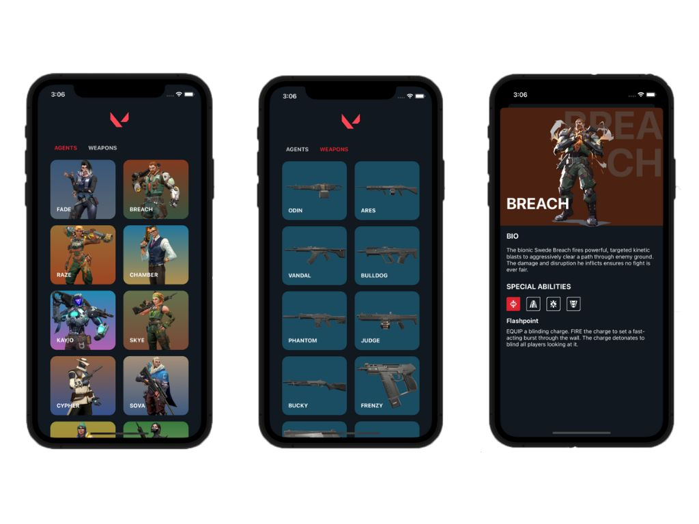

 

  <h3 align="center">Valorant</h3>

  

    App do jogo Valorant
  

  
Índice

    <ol>
    <li>
      <a href="#sobre-o-projeto">Sobre o projeto</a>
      <ul>
        <li><a href="#construido-com">Construido com</a></li>
      </ul>
    </li>
    <li><a href="#contato">Contato</a></li>
  </ol>

## Sobre o projeto

Esse aplicativo permite consultar os personagens (Agents) e as armas do jogo Valorant. Além de obter informações sobre tais personagens, como a sua descrição e suas habilidades.

### Construído com

O projeto foi construído utilizando:

- [Swift](https://www.swift.org/)
- [Combine](https://github.com/ReactiveX/RxSwift)
- [Valorant-API](https://dash.valorant-api.com)

Design arquitetônico:

- VIPER

## Contato

William James - william.james.pj@gmail.com

Link do projeto: [https://github.com/william-james-pj/ValorantApp](https://github.com/william-james-pj/ValorantApp)
